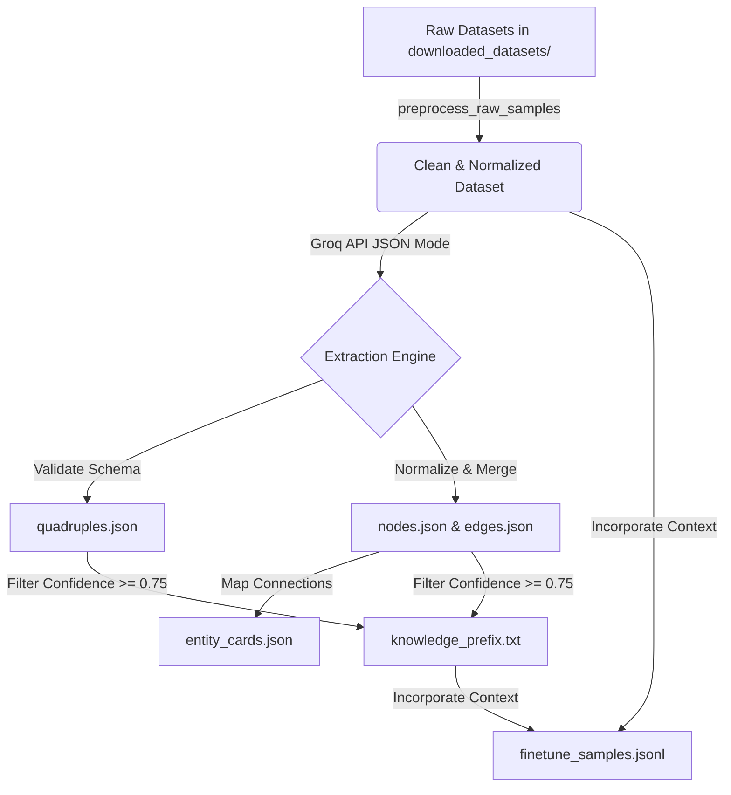

# Walkthrough: End-to-End Knowledge Graph Pipeline

We have successfully implemented the full end-to-end pipeline: **dataset thô -> tiền xử lí -> xây dựng KG -> tạo entity card -> knowledge prefix**.

## Pipeline Flow



1. **Dataset Thô (Raw Dataset)**:
   - Downloads raw datasets (CoLA, SST-2, Simple Wikipedia, SNLI, AG News, OpenOrca, Dialogsum, Anthropic HH) using `download_and_inspect_datasets.py` to `model-development/scripts/downloaded_datasets`.
   - Loaded and merged on-the-fly when pointing the input file path to the downloader directory.
2. **Tiền Xử Lý (Preprocessing)**:
   - Normalizes text and whitespace structure.
   - Filters out non-English content (via non-ASCII threshold checking).
   - Performs stable hashing (MD5) to enforce global and per-task deduplication.
   - Drops extremely short strings (< 5 characters).
   - Generates `preprocessed_dataset.jsonl` inside the output directory.
3. **Xây Dựng KG (Build KG)**:
   - Extracts tri-tuples and context properties using Groq API with Llama-3.1-8b-instant.
   - Validates relation predicates against allowed schema and standardizes entity references (names and aliases).
   - Exports `nodes.json`, `edges.json`, and `quadruples.json`.
4. **Tạo Entity Card (Entity Cards)**:
   - Generates consolidated profile cards for each node (`entity_cards.json`) showing all relations, definitions, and examples.
5. **Knowledge Prefix**:
   - Collects high-confidence, non-uncertain facts into a prompt-ready prefix block `knowledge_prefix.txt` and embeds relevant context directly into `finetune_samples.jsonl`.

---

## Running the Pipeline

To download the raw data:
```bash
python3 download_and_inspect_datasets.py --multiplier 0.005 --yes
```

To run the complete preprocessing, KG extraction, card generation, and prefix pipeline:
```bash
python3 extract_kg.py --input-file downloaded_datasets --num-samples 10
```

### Verification Statistics
The end-to-end run completed successfully with the following outputs in `datasets/kg_output/`:
- **`preprocessed_dataset.jsonl`**: 10 clean preprocessed samples.
- **`nodes.json`**: 37 standardized entities.
- **`edges.json`**: 16 validated relationships connecting nodes.
- **`quadruples.json`**: 25 quadruples containing full trace metadata (evidence, sources, confidence scores).
- **`entity_cards.json`**: 37 detailed node cards.
- **`knowledge_prefix.txt`**: 26 high-confidence facts.
- **`finetune_samples.jsonl`**: 6 augmented training samples with context injection.
